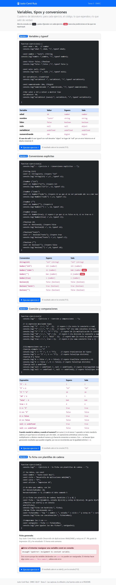
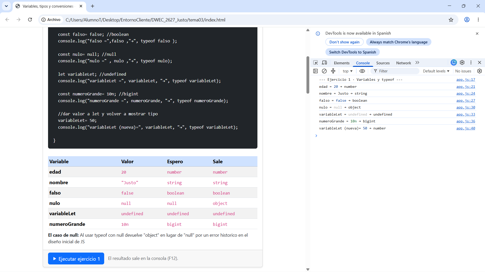
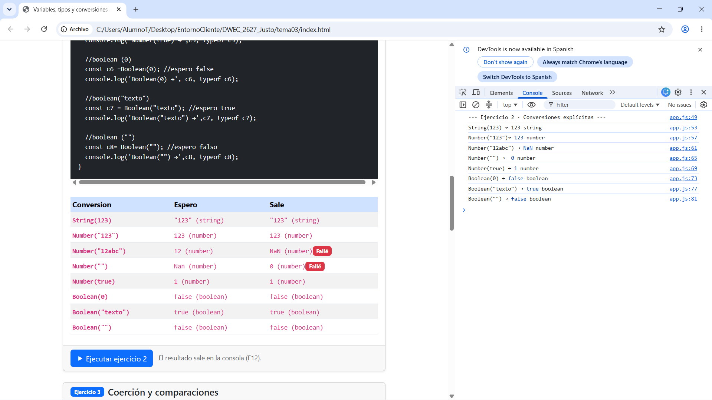
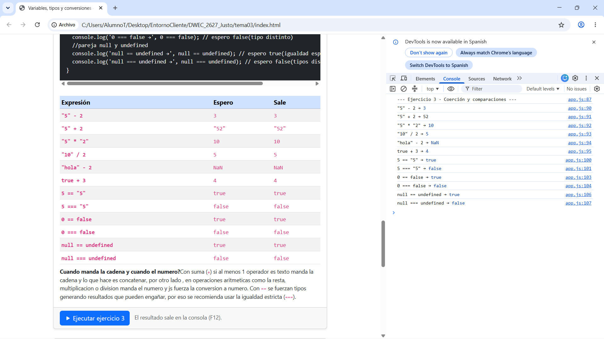
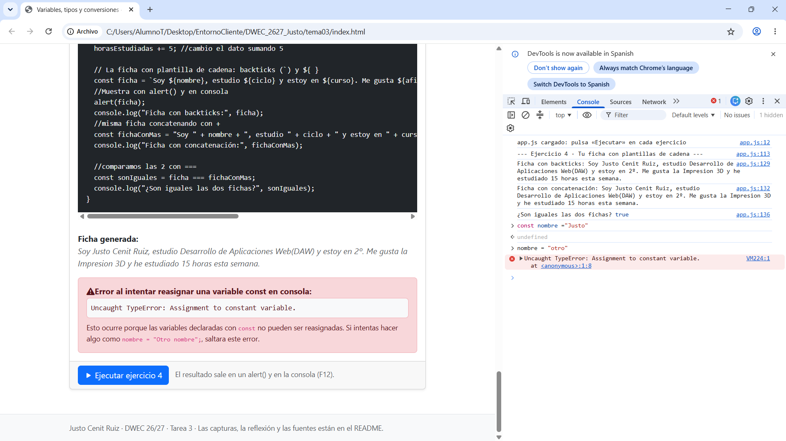

# Tarea 3 · Variables, tipos y conversiones

**Autor:** Justo Cenit Ruiz · Desarrollo Web en Entorno Cliente (DWEC) · 2.º DAW · Curso 2026-27

En esta carpeta está la práctica del tema 3 sobre variables, tipos y conversiones de DWEC. Para verla funcionando solo hay que abrir la carpeta en VS Code, pulsar en **Go Live**, abrir la consola del navegador con <kbd>F12</kbd> y darle a «Ejecutar» en cada ejercicio.

## Capturas

### a) La página entera

Vista completa de la página con mi nombre en la navbar, las cuatro cards de los ejercicios maquetadas con Bootstrap y los fallos de predicción marcados con los badges rojos.

### b) Consola del ejercicio 1

Salida por consola de los 6 tipos de variables obligatorios con su typeof y la reasignación de la variable declarada con let.

### c) Consola del ejercicio 2

Resultado de las 8 conversiones explícitas hechas con String(), Number() y Boolean() junto con el typeof que devuelve cada una.

### d) Consola del ejercicio 3

Comprobación de las expresiones con mezcla de tipos para ver la coerción implícita y las comparaciones con == y con ===.

### e) Consola del ejercicio 4, con el error de la const

Consola con los dos mensajes de la ficha (uno con plantilla y otro con +), la comprobación con === dando true y el TypeError provocado a mano al intentar reasignar una const.

## Reflexión

Al hacer las pruebas de las tablas, lo que me pareció más normal y lógico fueron las conversiones directas como `String(123)` pasando a texto o `Boolean("texto")` dando `true` al tener contenido. En cambio, lo que mass me chocó y donde fallé la predicción fue con `Number("")`, porque esperaba que diera `NaN` al estar vacía y resulta que en JS devuelve `0`. Otra cosa es que `Number("12abc")` da `NaN` en vez de quedarse con los primeros números como hace `parseInt`. Con la coerción de tipos se nota rápido la regla: con el `+` manda el string y concatena si hay texto de por medio, pero en la resta o la multiplicación manda el número y fuerza el cálculo numérico. Por último, ver que `0 == false` da `true` deja clarísimo por qué es mejor comparar siempre con `===` para no liarla con conversiones raras.

## Fuentes

- [MDN Web Docs · typeof](https://developer.mozilla.org/es/docs/Web/JavaScript/Reference/Operators/typeof)
- [MDN Web Docs · Coerción de tipos](https://developer.mozilla.org/es/docs/Glossary/Type_coercion)
- [MDN Web Docs · Plantillas de cadena](https://developer.mozilla.org/es/docs/Web/JavaScript/Reference/Template_literals)
- [Documentación oficial de Bootstrap 5.3](https://getbootstrap.com/docs/5.3/getting-started/introduction/)
- [PDF tema 3]
- [Gemini]  

## Uso de IA

He utilizado Gemini para resolver dudas, repasar la sintaxis de los ejercicios y entender bien el porque del fallo de `typeof null` y el error al intentar reasignar una `const`. Despues de consultar las explicaciones, he escrito y probado todo el codigo en mi consola, rellenado las tablas a mano y comprobado que los resultados salían como deberia ser.